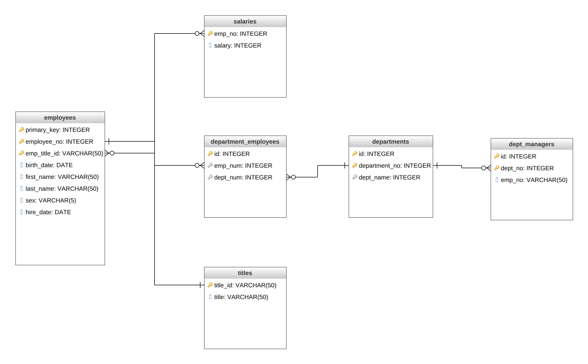
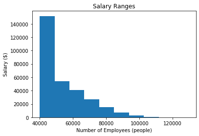
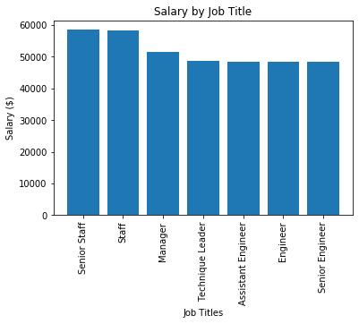

# **Relational Database Development using PostgreSQL**

## **Objective** :
* Develop a relational database, using PostgreSQL schema file, that connects employee, department, salaries and job titles datasets. 
  * Create an Entity Relationship Diagram (ERD) to visualize SQL database relationships.
* Write queries in pgAdmin (PostgreSQL) to extract particular data from the SQL database created. 
* Write Python queries using SqlAlchemy to visualize data and identify any irregularities. 

## **Database Development** :
[link to schema file](https://github.com/hedeencharles/PostgreSQL_Database_Project/blob/master/SQL_Files%26Queries/schema.sql)
### ERD Diagram :

* The above diagram visualizes the relational database that the [schema file](https://github.com/hedeencharles/PostgreSQL_Database_Project/blob/master/SQL_Files%26Queries/schema.sql) creates using PostgreSQL. 
  * The SQL database consist of multiple Foreign Keys, Primary Keys and designating ID columns. 

## **Queries using pgAdmin (PostgreSQL)** :
[link to SQL query file](https://github.com/hedeencharles/PostgreSQL_Database_Project/blob/master/SQL_Files%26Queries/query.sql)
* Data interested in querying:
  * Employee Details - first, last, number, sex, and salary
  * 1986 Employees Hired Details 
  * List of Department Managers and Details 
  * Departments of each employee
  * Query only last names beginning with "B"
  * All employees in the Sales Department
  * All employees in the Sales and Development Departments
  * List the frequency of each employer name, determine if the data sources are corrupt. 

## **Queries using Python and SqlAlchemy** :
[link to Python query file](https://github.com/hedeencharles/PostgreSQL_Database_Project/blob/master/Python_Notebook%26Queries/.ipynb_checkpoints/bonus_file-checkpoint.ipynb)
* For visualizations and analysis, the database was loaded into Python using SqlAlchemy and queried from a Python Notebook.
* Once the proper data was queried, Matplotlib was used to create graphs of depicting:
  * How salaries are distributed among total number of employees. 

  * How salaries vary by job title. 